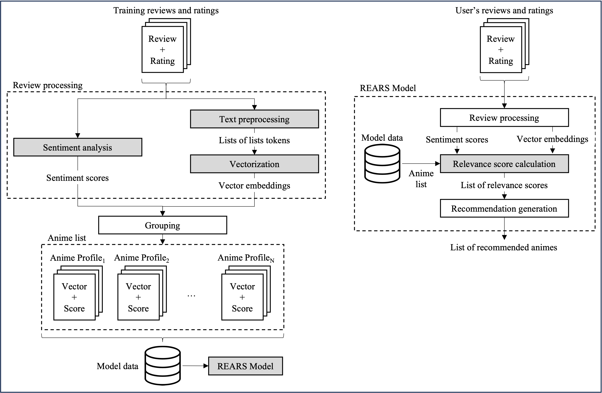
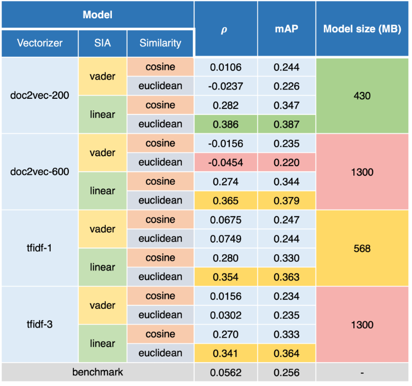

# REARS: Review-based Anime Recommendation System

This repository contains the code and resources for KAIST Spring 2023's course project of CS372: Natural Language Processing with Python. The project focuses on implementing a review-based anime recommendation system.

The figure below illustrates the workflow of the system during the training phase (left) and the working phase (right).



And below shows the results of the model evaluation.



## Project structure

The project is structured as follows:

```
├── clean.sh                # Shell script to clean the directory
├── demo.sh                 # Shell script to run the demo
├── README.md               # Project overview and instructions
├── requirements.txt        # Python dependencies
├── demo                    # Demo scripts
│   ├── data/               # Data for the demo
│   ├── demo1.sh            # First demo
│   ├── demo2.sh            # Second demo
│   └── setup.sh            # Setup script for the demo
└── src                     # Source code
    ├── benchmark.py        # Script for evaluating the benchmark model
    ├── config.py           # Configuration file
    ├── main.py             # Main script to run the project
    ├── rears/              # REARS package
    └── utils.py            # General utilities
```

## Getting started

1. Clone this repository to your local machine:

```bash
git clone https://github.com/kaiitunnz/review-based-anime-recommendation-system.git
cd review-based-anime-recommendation-system
```

2. Download the [Anime Dataset with Reviews - MyAnimeList dataset](https://www.kaggle.com/datasets/marlesson/myanimelist-dataset-animes-profiles-reviews) into `data/raw/`.
3. Install the dependencies.

```shell
pip install -r requirements.txt
```

4. Clean the downloaded dataset.

```shell
python src/main.py clean -vt
```

5. Build all the REARS models. This may take several hours depending on the execution environment.

```shell
python src/main.py build -avt
```

Alternatively, you can build a particular model using the command line options. For example,

```shell
python src/main.py build --vectorizers=doc2vec-200 --sias=linear --similarities=euclidean -vt
```

This will build a REARS model that uses a `doc2vec-200` vectorizer, `linear` sentiment analyzer, and `euclidean` similarity metric.

Or you can skip the building process and download the pre-trained models from [this drive](https://kaistackr-my.sharepoint.com/:u:/g/personal/noppanat_w_kaist_ac_kr/Ec8ZoPmrTstBl7E_ERe2s5oB3pktr2YTcjlLo-rHHKIn0g?e=FWavez).

6. Run the recommendation system to generate a list of recommended animes. For example,

```shell
python src/main.py run -u Sidewinder51 -n20 -vt
```

This will generate a list of recommended animes for the user "Sidewinder51". You can replace this with any username in the database or omit
it to use the username of the user who wrote the most reviews in the database.

Alternatively, you can run the following command to generate your own anime recommendation using your reviews file, which must be a csv file with 3 columns: "anime_id", "review", and "score".

```shell
python src/main.py run -f /path/to/my/reviews -u my_user_name -n20 -vt
```

7. Evaluate all the REARS models. This may take several hours depending on the execution environment.

```shell
python src/main.py eval -avt
```

Alternatively, you can evaluate a particular model using the command line options. For example,

```shell
python src/main.py eval --vectorizers=doc2vec-200 --sias=linear --similarities=euclidean -vt
```

This will evaluate a REARS model that uses a `doc2vec-200` vectorizer, `linear` sentiment analyzer, and `euclidean` similarity metric.

8. Run and evaluate the simple collaborative-filtering benchmark model.

```shell
python src/main.py bench -vt
```

The implementation of the benchmark model is based on [this tutorial](https://betterprogramming.pub/how-to-build-recommendation-models-with-myanimelist-and-sklearn-part-2-4802efba95cd).

## Demo

1. Clone this repository to your local machine:

```bash
git clone https://github.com/kaiitunnz/review-based-anime-recommendation-system.git
cd review-based-anime-recommendation-system
```

2. Download the [Anime Dataset with Reviews - MyAnimeList dataset](https://www.kaggle.com/datasets/marlesson/myanimelist-dataset-animes-profiles-reviews) into `data/raw/`.

3. Run the following commands:

```shell
./demo/setup.sh
./demo/demo1.sh
./demo/demo2.sh
```

You may need execution permissions for the three script files.
